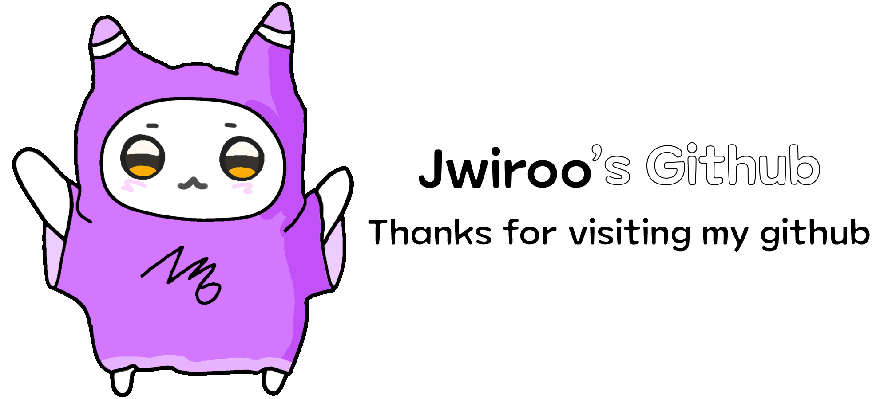

  

 

  <h3>📦 Tech Stack</h3>
  

    🖥️ FrontEnd
    

      
      
      
    

    

      
      
      
    

  

   
  

    🗄️BackEnd
    

      
      
      
    

  

 

  <h3>🛠️ Tools</h3>
  

    🔄 Version Control
    

      
      
    

  

   
  

    🐬 DB
    

      
    

  

   
  

    🎨 Design
    

      
      
      
    

  

   
  

    💻 Editor
    

      
    

  

 

  <h3>🚀 DevOps</h3>
  

    
    
  

 

  <h3>💌 Contact</h3>
  

    
  

 

 

  <h3>🔥 Stats</h3>
  

    
  

   
  

    
    
  

 

